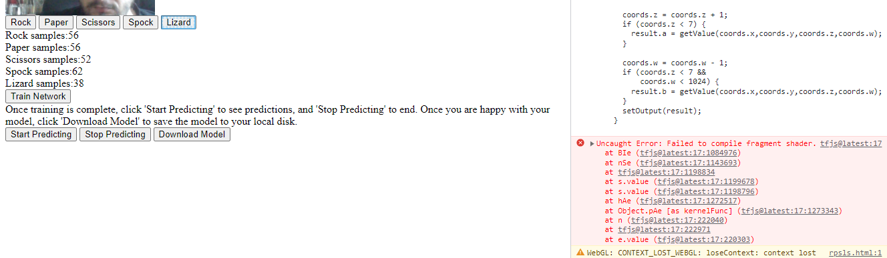

# Замітки щодо виконання лабораторних робіт по курсу Browser-based Models with TensorFlow.js

## Тиждень 1

https://www.coursera.org/learn/browser-based-models-tensorflow

- розширення WebServer вже не підтримується, тому його не можна використовувати, натомість у Brackets є вбудований сервер на базі Node.js (https://community.deeplearning.ai/t/web-server-for-chrome-no-longer-supported-on-chrome/219533/5)
- відкривається порожня сторінка і це нормально, бо там треба використовувати консоль
- видає помилку `DevTools failed to load source map: Could not load content for https://cdn.jsdelivr.net/npm/@tensorflow/tf.min.js.map: Помилка HTTP: код статусу 404, net::ERR_HTTP_RESPONSE_CODE_FAILURE`, але все одно працює
- Варто почитати довідку про [Dataset](https://js.tensorflow.org/api/latest/?_gl=1*t6m8cx*_ga*MTkwNTc5NjI5MS4xNjgwNDIzNzk0*_ga_W0YLR4190T*MTY4ODMxMzE0Ny4xOC4xLjE2ODgzMTMxNDcuMC4wLjA.#class:data.Dataset) та про методи, які використані в лабі. Погратися з виводами, наприклад:

```js
var tmp = await trainingData.toArray();
console.log (tmp);
tmp = await convertedTrainingData.toArray();
console.log (tmp);
```

## Тиждень 3.

- Не намагатися виконувати в Google Colab, там нова версія Python яка не підтримує стару версію tensorflow.js, а перевірка завдання ну курсі Coursera приймає результати тільки зі старої версії tensorflow.js 2.2. Мої спроби поставити на Google Colab стару версію привели до відключення GPU в Colab .
- проблеми та їх вирішення обговорюються [тут](https://community.deeplearning.ai/t/error-installing-tensorflow-2-2-on-colab-as-well-as-anaconda/287783/25) , ось запропонований варіант там:

```

    navigate to your assignment folder
    conda create -n tf210 tensorflow=2.1.0 python=3.7
    conda activate tf210
    pip install tensorflowjs==2.0.0
    pip install tensorflow-intel==0.0.1
    pip install tensorflow-cpu==2.1.0
    pip install tensorflow-estimator==2.1.0rc0
    pip install tensorflow==2.2.0
    pip install jupyter notebook
    pip install matplotlib
    jupyter notebook

```

- я зробив наступне: 
  - поставив на свій комп [miniconda](https://docs.conda.io/en/latest/miniconda.html#installing) 
  - перейшов з консольного рядка в папку встановлення
  - враховуючи що були помилки в пропозиціях вище, замість `pip install tensorflow-intel==0.0.1`  встановив 2.2.0, тобто зробив таку послідовність з командного рядка: 

```
    conda create -n tf210 tensorflow=2.1.0 python=3.7
    conda activate tf210
    pip install tensorflowjs==2.0.0
    pip install tensorflow-intel==0.0.1
    pip install tensorflow-cpu==2.2.0
    pip install tensorflow-estimator==2.1.0rc0
    pip install tensorflow==2.2.0
    pip install jupyter notebook
    pip install matplotlib
    jupyter notebook
```

- після запуску jupyter (в браузері) завантажив усі потрібні файли, у файлі шаблону видалив усі звернення до консолі середовища (тобто які починалися з `!`) і зробив все інше
- файли `bin` та `JSON` запакував в zip і відправив на coursera 

## Тиждень 4

Після  завантаження великої кількості фотографій або на початку навчання вилітає помилка "WebGL: CONTEXT_LOST_WEBGL: loseContext: context lost." 



Я так зрозумів що не вистачає пам'яті. Лікується шляхом використання більш потужного компа. Тренувати треба акуратно, і на кількості зображень для кожної мітки >50, у моєму випадку по 70. Якщо модель буде недостатньо навчена, результати не будуть зараховані.    
