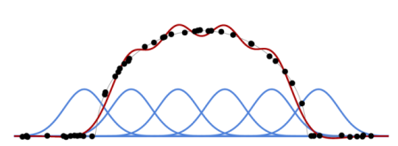

[<---  1.1 Навчання на основі даних ](1_1_Learning_from_data.md)         [Зміст](README.md)          [1_3_Under_and_overfitting    --->](1_3_Under_and_overfitting.md) 

## 1.2 Регресія на основі базисних функцій

Ми можемо проілюструвати навчання моделі на простому випадку, де $x_n$ і $y_n$ є двома дійсними числами,
втрата - це **середнє квадратичне відхилення (mean squared error)**:
$$
\mathscr{L}(w)=\frac{1}{N}\sum_{n=1}^N(y_n-f(x_n;w))^2 \tag{1.1}
$$
і $f(\cdot;w)$ є лінійною комбінацією попередньо означеного базису функцій $f_1,...,f_K$, з $w=(w_1,...,w_K)$:
$$
f(x;w)=\sum_{k=1}^Kw_kf_k(x)
$$
Оскільки $f(x_n;w)$ є лінійною відносно параметрів $w_k$, а $\mathscr{L}(w)$ є квадратичною відносно $f(x_n;w)$, функція втрат $\mathscr{L}(w)$ є квадратичною по відношенню до параметрів $w_k$. Тому пошук $w^*$, які мінімізують функцію втрат, зводиться до вирішення лінійної системи. Дивіться рис. 1.1 для прикладу з Гаусовими ядрами (Gaussian kernels) як $f_k$.

Рисунок 1.1: На основі базисних функцій (сині криві) і навчального набору (чорні крапки), ми можемо обчислити оптимальну лінійну комбінацію (суму) цих базисних функцій(червона крива), щоб наблизити навчальний набір даних за середнім квадратичним відхиленням.
