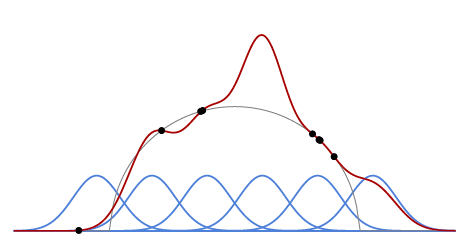

[<---   1.2 Регресія на основі базисних функцій](1_2_Basis_function_regression.md)         [Зміст](README.md)          [1_4_Categories_of_models    --->](1_4_Categories_of_models.md) 

## 1.3 Недостатнє навчання та перенавчання

Ключовим елементом є взаємодія між **ємністю (capacity)** моделі, тобто її гнучкістю та здатністю адаптувати різноманітні дані, та кількістю та якістю навчальних даних. Коли ємності недостатньо, модель не може вмістити дані, а похибка (error) під час навчання є високою. Це називається **недостатнім навчанням (underfitting)**..

Навпаки, коли обсяг даних недостатній, як показано на прикладі на рис.1.2, продуктивність (performance) під час навчання може бути чудовою, але не пов’язаною з фактичною відповідністю структурі даних, оскільки в цьому випадку модель часто вивчатиме випадковий шум, присутній у сигналі. Це називається  **перенавчанням (overfitting)**.

 

Рис. 1.2. Якщо кількість навчальних даних є невеликою порівняно з ємністю моделі, продуктивність
під час навчання погано відображає фактичну відповідність базовій структурі даних і, отже корисність для прогнозування є малою.

Отже, велика частина мистецтва прикладного машинного навчання полягає в розробленні моделей, які не є надто гнучкими, але все ще здатні підганяти дані. Це робиться шляхом формування правильного **індуктивного упередження (inductive bias)** в моделі, що означає, що її структура відповідає основній структурі наявних даних.

Незважаючи на те, що ця класична перспектива є актуальною для глибоких моделей розумного розміру, все стає заплутано для тих моделей, які мають дуже велику кількість налаштовуваних параметрів, і надзвичайну ємність, але все ще добре працюють для прогнозування. Ми повернемося до цього в [§3.5](3_5_Training_protocols.md).

### Від перекладача

- [Перенавчання Wiki uk](https://uk.wikipedia.org/wiki/%D0%9F%D0%B5%D1%80%D0%B5%D0%BD%D0%B0%D0%B2%D1%87%D0%B0%D0%BD%D0%BD%D1%8F)
- [Overfitting Wiki](https://en.wikipedia.org/wiki/Overfitting)
- [Inductive bias Wiki](https://en.wikipedia.org/wiki/Inductive_bias)