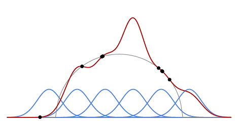

## 1.3 Under and overfitting

A key element is the interplay between the **capacity** of the model, that is its flexibility and ability to fit diverse data, and the amount and quality of the training data. When the capacity is insufficient, the model cannot fit the data and the error during training is high. This is referred to as **underfitting**.

On the contrary, when the amount of data is insufficient, as illustrated with an example in Figure 1.2, the performance during training can be excellent, but unrelated to the actual fit to the data structure, as in that case the model will often learn random noise present in the signal. This is **overfitting**.

 

Figure 1.2: If the amount of training data is small compared to the capacity of the model, the performance during training reflects poorly the actual fit to the underlying data structure, and consequently the usefulness for prediction. 

So, a large part of the art of applied machine learning is to design models that are not too flexible yet still able to fit the data. This is done by crafting the right **inductive bias** in a model, which means that its structure corresponds to the underlying structure of the data at hand.

Even though this classical perspective is relevant for reasonably-sized deep models, things get confusing with large ones that have a very large number of trainable parameters and extreme capacity yet still perform well for prediction. We will come back to this in § 3.5.