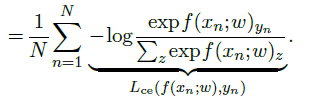

|                                         |                    |                                                              |
| --------------------------------------- | ------------------ | ------------------------------------------------------------ |
| [<---   3__Training.md](3__Training.md) | [Зміст](README.md) | [3_2_Autoregressive_models.md    --->](3_2_Autoregressive_models.md) |

## 3.1    Losses

The example of the **mean squared error** of Equation [1.1](1_1_Learning_from_data.md) is a standard loss for predicting a continuous
value.

For density modeling, the standard loss is the likelihood of the data. If $f(x;w)$ is to be interpreted as a normalized log-probability or log-density, the loss is the opposite of the sum of its value over training samples.

#### Cross-entropy

For classification, the usual strategy is that the output of the model is a vector with one component $f(x;w)_y$ per class $y$, interpreted as the logarithm of a non-normalized probability, or **logit**.

With $X$ the input signal and $Y$ the class to predict, we can then compute from $f$ an estimate
of the **posterior probabilities**:

$$
\hat{P}(Y=y\ |\ X=x) = \frac{\exp f(x;w)_y}{\sum_z \exp f(x;w)_z}
$$

This expression is generally referred to as the **softmax**, or more adequately, the **softargmax**, of the logits.

To be consistent with this interpretation the model should be trained to maximize the probability of the true classes, hence to minimize the **cross-entropy**, expressed as:

$$
\mathscr{L}_{ce}(w)=-\frac{1}{N}\sum_{n=1}^{N}\log \hat{P}(Y=y_n\ |\ X=x_n)
$$

#### Contrastive loss

In certain setups, even though the value to be predicted is continuous, the supervision takes the form of ranking constraints. The typical domain where this is the case is **metric learning**, where the objective is to learn a measure of distance between samples such that a sample $x_a$ from a certain semantic class is closer to any sample $x_b$ of the same class than to any sample $x_c$ from another class. For instance, $x_a$ and $x_b$ can be two pictures of a certain person, and $x_c$ a picture of someone else.

The standard approach for such cases is to minimize a **contrastive loss**, in that case, for instance, the sum over triplets $(x_a,x_b,x_c)$, such that $y_a = y_b \ne y_c$, of

$$
\max(0,1-f(x_a,x_c;w)+f(x_a,x_b;w))
$$

This quantity will be strictly positive unless

$$
f(x_a,x_c;w)\ge 1+f(x_a,x_b;w)
$$

#### Engineering the loss

Usually, the loss minimized during training is not the actual quantity one wants to optimize ultimately, but a proxy for which finding the best model parameters is easier. For instance, crossentropy is the standard loss for classification, even though the actual performance measure is a classification error rate, because the latter has no informative gradient, a key requirement as we will see in [§ 3.3](3_3_Gradient_descent.md).

It is also possible to add terms to the loss that depend on the trainable parameters of the model themselves to favor certain configurations.

The **weight decay** regularization, for instance, consists of adding to the loss a term proportional to the sum of the squared parameters. It can be interpreted as having a Gaussian Bayesian prior on the parameters, which favors smaller values and reduces the influence of the data. This degrades performance on the training set, but reduces the gap between the performance in training and that on new, unseen data.