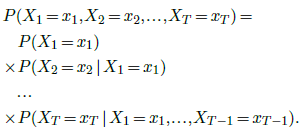

[<---   3_1_Losses.md](3_1_Losses.md)         [Зміст](README.md)          [3_3_Gradient_descent.md    --->](3_3_Gradient_descent.md) 

## 3.2    Autoregressive models

Many spectacular applications in computer vision and natural language processing have been tackled with **autoregressive models** of discrete sequences.

### The chain rule

Such models put to use the **chain rule** from probability theory:

Although it is valid for any type of random quantity, this decomposition finds its most efficient use when the signal of interest can be encoded into a sequence of discrete **tokens** from a finite **vocabulary** $\{1,...K\}$.

With the convention that the additional token $∅$ stands for an “unknown” quantity, we can represent
the event $\{X_1 =x_1,...,X_t =x_t\}$ as the vector $(x_1,...,x_t,∅,...,∅)$.

Then, given a model

the chain rule states that one can sample a full sequence of length $T$ by sampling the xts one after another, each according to the predicted posterior distribution, given the $x_1,...,x_{t−1}$ already sampled. This is an **autoregressive** generative model.

### Causal models

Training such a model could be achieved naively by minimizing the sum across training sequences $x$ and time steps $t$ of

however such an approach is inefficient, as most computations done for $t<t^′$ have to be repeated
for $t^′$.

The standard strategy to address this issue is to design a model $f$ that predicts the distributions of all the $x_t$ of the sequence at once, but which has a structure such that the computed logits for e.g. $x_t$ depend only on the input values $x_1,...,x_{t−1}$. Such a model is called **causal**, since it corresponds in the case of temporal series to not letting the future influence the past, as illustrated in Figure 3.1.

Figure 3.1: An autoregressive model $f$, is **causal** if a time step $x_t$ of the input sequence can only modulate
a predicted $y_s = \hat{P}(X_s |X_{t<s})$ for $s>t$.

The consequence is that the output at every position is the one that would be obtained if the input was only available up to before that position. Hence, training can be done by computing the output for a full training sequence, and maximizing the predicted probabilities of all the tokens of that same sequence, which boils down to minimizing the sum of the per-token **cross-entropy**.

### Tokenizer

One important technical detail when dealing with natural languages is that the representation as tokens can be done in multiple ways, from the finest granularity of individual symbols to entire words. The conversion to and from the token representation is done by a separate algorithm called a **tokenizer**.

A standard method is the **Byte Pair Encoding** (**BPE**) [Sennrich et al., 2015] that constructs tokens by hierarchically merging groups of characters, trying to get tokens that represent fragments of words of various lengths but of similar frequencies, allocating tokens to long frequent fragments, as well as to rare individual symbols.