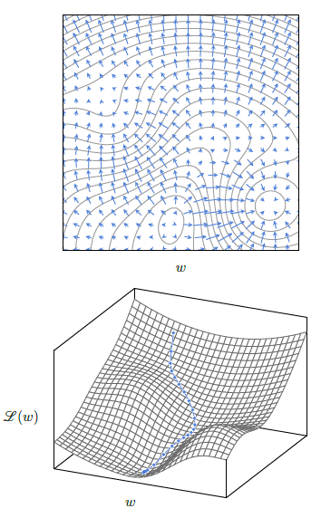

## 3.3    Gradient descent

Except in specific cases like the linear regression we saw in [§ 1.2](1_2_Basis_function_regression.md), the optimal parameters $w^∗$ do
not have a closed-form expression. In the general case, the tool of choice to minimize a function is **gradient descent**. It starts by initializing the parameters with a random $w_0$, and then improves this estimate by iterating **gradient steps**, each consisting of computing the gradient of the loss with respect to the parameters, and subtracting a fraction of it:

This procedure corresponds to moving the current estimate a bit in the direction that locally decrease $\mathscr{L}(w)$ maximally, as illustrated in Figure 3.2.

 

Figure 3.2: At every point w, the gradient $∇ℒ_{\mid w}(w)$ is in the direction that maximizes the increase of $ℒ$, orthogonal to the level curves (top). The gradient descent minimizes $ℒ(w)$ iteratively by subtracting a fraction of the gradient at every step, resulting in a trajectory that follows the steepest descent (bottom).

#### Learning rate

The meta-parameter $η$ is referred to as the **learning rate**. It is a positive value that modulates how quickly the minimization is done, and has to be chosen carefully.

If it is too small, the optimization will be slow at best, and may be trapped in a **local minimum** early. If it is too large, the optimization may bounce around a good minimum and never descend into it. Aswe will see in [§ 3.5](3_5_Training_protocols.md), it can depend on the iteration number $n$.

#### Stochastic Gradient Descent

All the losses used in practice can be expressed as an average of a loss per sample, or per small group of samples:

where $𝓁_n(w)=L(f(x_n;w),y_n)$ for some $L$, and the gradient is then:

The resulting **gradient descent** would compute exactly the sum in Equation 3.2, which is usually computationally heavy, and then update the parameters according to Equation 3.1. However, under reasonable assumptions of exchangeability, for instance, if the samples have been properly shuffled, any partial sum of Equation 3.2 is an unbiased estimator of the full sum, albeit noisy. So, updating the parameters from partial sums corresponds to doing more gradient steps for the same computational budget, with noisier estimates of the gradient. Due to the redundancy in the data, this happens to be a far more efficient strategy.

We saw in § 2.1 that processing a batch of samples small enough to fit in the computing device’s memory is generally as fast as processing a single one. Hence, the standard approach is to split the full set $\mathscr{D}$ into **batches**, and to update the parameters from the estimate of the gradient computed from each. This is referred to as minibatch stochastic gradient descent, or **stochastic gradient descent** (**SGD**) for short.

It is important to note that this process is extremely gradual, and that the number of minibatches and gradient steps are typically of the order of several millions.

As with many algorithms, intuition breaks down in high dimensions, and although it may seem that this procedure would be easily trapped in a local minimum, in reality, due to the number of parameters, the design of the models, and the stochasticity of the data, its efficiency is far greater than one might expect.

Plenty of variations of this standard strategy have been proposed. The most popular one is **Adam** [Kingma and Ba, 2014], which keeps running estimates of the mean and variance of each component of the gradient, and normalizes them automatically, avoiding scaling issues and different training speeds in different parts of a model.