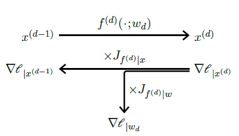
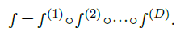
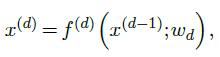

|                                                           |                    |                                                              |
| --------------------------------------------------------- | ------------------ | ------------------------------------------------------------ |
| [<---   3_3_Gradient_descent.md](3_3_Gradient_descent.md) | [Зміст](README.md) | [3_5_Training_protocols.md    --->](3_5_Training_protocols.md) |

## 3.4    Backpropagation

Using **gradient descent** requires a technical means to compute $∇𝓁_{|w}(w)$ where $𝓁=L(f(x;w);y)$. Given that $f$ and $L$ are both compositions of standard tensor operations, as for any mathematical expression, the **chain rule** from differential calculus allows us to get an expression of it.

For the sake of making notation lighter–which, unfortunately, will be needed in what follows-we do not specify at which point gradients are computed, since the context makes it clear. 

Figure 3.3: Given a model $f =f^{(D)}◦···◦f^{(1)}$, the forward pass (top) consists of computing the outputs $x^{(d)}$ of the mappings $f^{(d)}$ in order. The backward pass (bottom) computes the gradients of the loss with respect to the activation $x^{(d)}$ and the parameters $w_d$ backward by multiplying them by the Jacobians.

#### Forward and backward passes

Consider the simple case of a composition of mappings:

The output of $f(x;w)$ can be computed by starting with $x^{(0)} =x$ and applying iteratively:

with $x^{(D)}$ as the final value.

The individual scalar values of these intermediate results $x^{(d)}$ are traditionally called **activations** in reference to neuron activations, the value $D$ is the **depth** of the model, the individual mappings $f^{(d)}$ are referred to as **layers**, as we will see is [§ 4.1](4_1_The_notion_of_layer.md), and their sequential evaluation is the **forward pass** (see Figure 3.3, top).

Conversely, the gradient $∇𝓁_{|x^{(d−1)}}$ of the loss with respect to the output $x^{(d−1)}$ of $f^{(d−1)}$ is the product of the gradient $∇𝓁_{|x^{(d)}}$ with respect to the output of $f^{(d)}$ multiplied by the Jacobian $J_{f^{(d−1)}|x}$ of $f^{(d−1)}$ with respect to its variable $x$. Thus, the gradients with respect to the outputs of all the $f^{(d)}$s can be computed recursively backward, starting with $∇𝓁_{|x^{(D)}} =∇L_{|x}$.

And the gradient that we are interested in for training, that is $∇𝓁_{|w_d}$ , is the gradient with respect to the output of $f^{(d)}$ multiplied by the Jacobian $J_{f^{(d)}|w}$ of $f^{(d)}$ with respect to the parameters.

This iterative computation of the gradients with respect to the intermediate activations, combined with that of the gradients with respect to the layers’ parameters, is the **backward pass** (see Figure 3.3, bottom). The combination of this computation with the procedure of gradient descent is called **backpropagation**.

In practice, the implementation details of the forward and backward passes are hidden from programmers. Deep learning frameworks are able to automatically construct the sequence of operations to compute gradients. A particularly convenient algorithm is **Autograd** [Baydin et al., 2015], which tracks tensor operations and builds, on the fly, the combination of operators for gradients. Thanks to this, a piece of imperative programming that manipulates tensors can automatically compute the gradient of any quantity with respect to any other.

#### Resource usage

Regarding the **computational cost**, as we will see, the bulk of the computation goes into linear operations that require one matrix product for the forward pass and two for the products by the Jacobians for the backward pass, making the latter roughly twice as costly as the former.

The **memory requiremen**t during inference is roughly equal to that of the most demanding individual layer. For training, however, the backward pass requires keeping the activations computed during the forward pass to compute the Jacobians, which results in a memory usage that grows proportionally to the model’s depth. Techniques exist to trade the memory usage for computation by either relying on **reversible layers** [Gomez et al., 2017], or using **checkpointing**, which consists of storing activations for some layers only and recomputing the others on the fly with partial forward passes during the backward pass [Chen et al., 2016].

#### Vanishing gradient

A key historical issue when training a large network is that when the gradient propagates backwards through an operator, it may be rescaled by a multiplicative factor, and consequently decrease or increase exponentially when it traverses many layer. When it decreases exponentially, this is called the **vanishing gradient**, and it may make the training impossible, or, in its milder form, cause different parts of the model to be updated at different speeds, degrading their co-adaptation [Glorot and Bengio, 2010].

As we will see in Chapter 4, multiple techniques have been developed to prevent this from happening, reflecting a change in perspective that was crucial to the success of deep-learning: instead of trying to improve generic optimization methods, the effort shifted to engineering the models themselves to make them optimizable.
