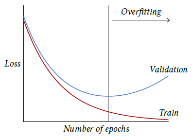

|                                                         |                    |                                                              |
| ------------------------------------------------------- | ------------------ | ------------------------------------------------------------ |
| [<---   3_4_Backpropagation.md](3_4_Backpropagation.md) | [Зміст](README.md) | [3_6_The_benefits_of_scale.md    --->](3_6_The_benefits_of_scale.md) |

## 3.5    Training protocols

Training a deep network requires defining a protocol to make the most of computation and data, and ensure that performance will be good on new data.

As we saw in [§ 1.3](1_3_Under_and_overfitting.md), the performance on the training samples may be misleading, so in the simplest setup one needs at least two sets of samples: one is a **training set**, used to optimize the model parameters, and the other is a **testset**, to estimate the performance of the trained model.

Additionally, there are usually **meta-parameters** to adapt, in particular, those related to the model architecture, the learning rate, and the regularization terms in the loss. In that case, one needs a **validation set** that is disjoint from both the training set and the test set to assess the best configuration.

The full training is usually decomposed into **epochs**, each of them corresponding to going through all the training examples once. The usual dynamic of the losses is that the train loss decreases as long as the optimization runs while the validation loss may reach a minimum after a certain number of epochs and then start to increase, reflecting an **overfitting** regime, as introduced in [§ 1.3](1_3_Under_and_overfitting.md) and illustrated on Figure 3.4.

Figure 3.4: As training progresses, a model’s performance is usually monitored through losses. The train loss is the one driving the optimization process and goes down, while the validation loss is estimated on an other set of examples to assess the overfitting of the model. Overfitting appears when the model starts to take into account random structures specific to the training set at hands, resulting in the validation loss starting to increase.

Paradoxically, although they should suffer from severe overfitting due to their capacity, large models usually continue to improve as training progresses. This may be due to the **inductive bias** of the model becoming the main driver of optimization when performance is near perfect on the training set [Belkin et al., 2018].

An important design choice is the **learning rate schedule** during training. The general policy is that the learning rate should be initially large to avoid having the optimization being trapped in a bad local minimum early, and that it should get smaller so that the optimized parameter values do not bounce around, and reach a good minimum in a narrow valley of the loss landscape.

The training of extremely large models may take months on thousands of powerful GPUs and have a financial cost of several million dollars. At this scale, the training may involve many manual interventions informed, in particular, by the dynamics of the loss evolution.
