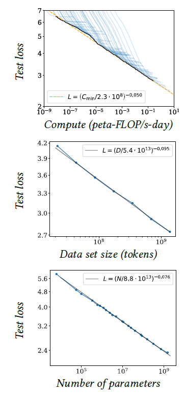
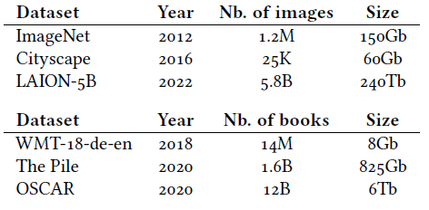
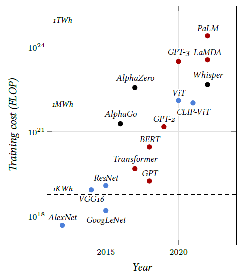

## 3.6    The benefits of scale

There is an accumulation of empirical results showing that performance, for instance, estimated through the loss on test data, improves with the amount of data according to remarkable **scaling laws**, as long as the model size increases correspondingly [Kaplan et al., 2020] (see Figure 3.5).

Benefiting from these scaling laws in the multibillion samples regime is possible in part thanks to the structural plasticity of models, which allows them to be scaled up arbitrarily, as we will see, by increasing the number of layers or feature dimensions. But it is also made possible by the distributed nature of the computation implemented by these models and by **stochastic gradient descent**, which requires only a tiny fraction of the data at a time and can operate with data sets whose size is orders of magnitude greater than that of the computing device’s memory. This has resulted in an exponential growth of the models, as illustrated in Figure 3.6.

Typical vision models have 10–100 million **trainable parameters** and require $10^{18}–10^{19}$ FLOPs
for training [He et al., 2015; Sevilla et al., 2022]. Language models have from 100 million to hundreds of billions of trainable parameters and require $10^{20}–10^{23}$ FLOPs for training [Devlin et al., 2018; Brown et al., 2020; Chowdhery et al., 2022; Sevilla et al., 2022]. The latter require machines with multiple high-end GPUs.

Figure 3.5: Test loss of a language model vs. the amount of computation in petaflop/s-day, the data set size in tokens, that is fragments of words, and the model size in parameters [Kaplan et al., 2020].

Table 3.1: Some examples of publicly available datasets. The equivalent number of books is an indicative estimate for 250 pages of 2000 characters per book.

Training these large models is impossible using datasets with a detailed ground-truth costly to produce, which can only be of moderate size. Instead, it is done with datasets automatically produced by combining data available on the internet with minimal curation, if any. These sets may combine multiple modalities, such as text and images from web pages, or sound and images from videos, which can be used for largescale supervised training.

Figure 3.6: Training costs in number of FLOP of somelandmark models [Sevilla et al., 2023]. The colors indicate the domains of application: Computer Vision (blue), Natural Language Processing (red), or other (black). The dashed lines correspond to the energy consumption using A100s SXM in 16 bits precision.

The most impressive current successes of artificial intelligence rely on very large language models, which we will see in [§ 5.3](5_3_Attention_models.md) and [§ 7.1](7_1_Text_generation.md), trained on extremely large text datasets (see Table 3.1).
