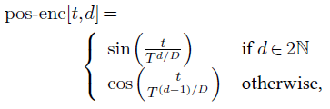

## 4.10    Positional encoding

While the processing of a **fully-connected layer** is specific to both the positions of the features in the input tensor and to the position of the resulting activation in the output tensor, **convolutional layers** and **multi-head attention layers** are oblivious to the absolute position in the tensor. This is key to their strong invariance and inductive bias, which is beneficial for dealing with a stationary signal.

However, this can be an issue in certain situations where proper processing has to access the absolute positioning. This is the case, for instance, for image synthesis, where the statistics of a scene are not totally stationary, or in natural language processing, where the relative positions of words strongly modulate the meaning of a sentence.

The standard way of coping with this problem is to add or concatenate a **positional encoding**, which is a feature vector that depends on the location, to the feature representation at every position. This positional encoding can be learned as other layer parameters, or defined analytically. For instance, in the original **Transformer** model, for a series of vectors of dimension $D$, Vaswani et al. [2017] add an encoding of the sequence index as a series of sines and cosines at various frequencies:

with $T =10^4$.
