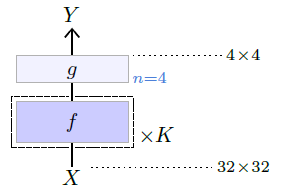

## 4.1    The notion of layer

We call **layers** standard complex compounded tensor operations that have been designed and empirically identified as being generic and efficient. They often incorporate trainable parameters and correspond to a convenient level of granularity for designing and describing large deep models. The term is inherited from simple multi-layer neural networks, even though modern models may take the form of a complex graph of such modules, incorporating multiple parallel pathways.

In the following pages, I try to stick to the convention for model depiction illustrated above:

- operators / layers are depicted as boxes,
- darker coloring indicates that they embed trainable parameters,
- non-default valued meta-parameters are added in blue on their right,
- a dashed outer frame with a multiplicative factor indicates that a group of layers is replicated in series, each with its own set of trainable parameters if any, and
- in some cases, the dimension of their output is specified on the right when it differs from their input.

Additionally, layers that have a complex internal structure are depicted with a greater height.
