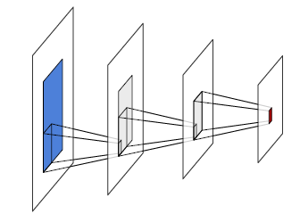

## 4.2    Linear layers

 The most important modules in terms of computation and number of parameters are the **Linear layer**s. They benefit from decades of research and engineering in algorithmic and chip design for matrix operations.

Note that the term “linear” in deep learning generally improperly refers to an **affine operation**, that is the sum of a linear expression and a constant bias.

### Fully-connected layers

The most basic one is the **fully-connected layer**, parameterized by $w=(W,b)$, where $W$ is a $D^′×D$ **weight matrix**, and $b$ is a **bias vector** of dimension $D^′$.  It implements a matrix/vector product generalized to arbitrary tensor shapes. Given an input $X$ of dimension $D_1×···×D_K×D$, it computes an output $Y$ of dimension $D_1×···× D_K×D^′$ with

While at first sight such an affine operation seems limited to geometric transformations such as rotations or symmetries, it can implement far more than that. In particular, projections for dimension reduction or signal filtering, but also, from the perspective of the dot product being a measure of similarity, a matrix-vector product can be interpreted as computing matching scores between a query, as encoded by the vector, and keys, as encoded by the matrix rows.

As we saw in § 3.3, the gradient descent starts with the **parameters’ random initialization**. If this is done too naively, as seen in [§ 3.4](3_4_Backpropagation.md), the network may suffer from exploding or vanishing activations and gradients [Glorot and Bengio, 2010]. Deep learning frameworks implement initialization methods that in particular scale the random parameters according to the dimension of the input to keep the variance of the activations constant and prevent pathological behaviors.

### Convolutional layers

A linear layer can take as input an arbitrarily-shaped tensor by reshaping it into a vector, as long as it has the correct number of coefficients. However, such a layer is poorly adapted to dealing with large tensors, since the number of parameters and number of operations are proportional to the product of the input and output dimensions. For instance, to process an RGB image of size $256×256$ as input and compute a result of the same size, it would require approximately $4×10^{10}$ parameters and multiplications.

Figure 4.1: A $1D$ convolution (left) takes as input a $D×T$ tensor $X$, applies the same affine mapping $\phi(·;w)$ to every sub-tensor of shape $D×K$, and stores the resulting $D^′×1$ tensors into $Y$ . A $1D$ transposed convolution (right) takes as input a $D×T$ tensor, applies the same affine mapping $ψ(·;w)$ to every subtensor of shape $D×1$, and sums the shifted resulting $D^′×K$ tensors. Both can process inputs of different size.

Figure 4.2: A $2D$ convolution (left) takes as input a $D×H×W$ tensor $X$, applies the same affine mapping $\phi(·;w)$ to every sub-tensor of shape $D×K×L$, and stores the resulting $D^′×1×1$ tensors into $Y$ . A $2D$ transposed convolution (right) takes as input a $D×H×W$ tensor, applies the same affine mapping $ψ(·;w)$ to every $D×1×1$ sub-tensor, and sums the shifted resulting $D^′×K×L$ tensors into $Y$ .

Besides these practical issues, most of the high-dimension signals are strongly structured. For instance, images exhibit short-term correlations and statistical stationarity to translation, scaling, and certain symmetries. This is not reflected in the **inductive bias** of a fully-connected layer, which completely ignores the signal structure.

Figure 4.3: Beside its kernel size and number of input / output channels, a convolution admits three meta-parameters: the stride s (left) modulates the step size when going though the input tensor, the padding $p$ (top right) specifies how many zeros entries are added around the input tensor before processing it, and the dilation $d$ (bottom right) parameterizes the index count between coefficients of the filter.

To leverage these regularities, the tool of choice is **convolutional layers**, which are also affine, but process time-series or 2D signals locally, with the same operator everywhere.

A **1D convolution** is mainly defined by three meta-parameters: its **kernel size** $K$, its number of input channels $D$, its number of output channels $D^′$, and by the trainable parameters $w$ of an affine mapping $\phi(·;w) :R^{D×K} →R^{D^′×1}$.

It can process any tensor $X$ of size $D×T$ with $T ≥K$, and applies $\phi(·;w)$ to every sub-tensor $D×K$ of $X$, storing the results in a tensor $Y$ of size $D^′×(T−K+1)$, as pictured in Figure 4.1 (left).

A **2D convolution** is similar but has a $K×L$ kernel and takes as input a $D×H×W$ tensor (see
Figure 4.2, left).

Both operators have for trainable parameters those of $\phi$ that can be envisioned as $D^′$ **filters** of size $D×K$ or $D×K×L$ respectively, and a **bias vector** of dimension $D^′$.

They also admit three additional meta-parameters, illustrated on Figure 4.3:

- The **padding** specifies how many zero coefficients should be added around the input tensor before processing it, particularly to maintain the tensor size when the kernel size is greater than one. Its default value is 0.
- The **stride** specifies the step used when going through the input, allowing one to reduce the output size geometrically by using large steps. Its default value is 1.
- The **dilation** specifies the index count between the filter coefficients of the local affine operator. Its default value is 1, and greater values correspond to inserting zeros between the coefficients, which increases the filter / kernel size while keeping the number of trainable parameters unchanged.

Except for the number of channels, a convolution’s output is usually strictly smaller than its input by roughly the size of the kernel, or even by a scaling factor if the stride is greater than one.

Given an activation computed by a convolutional layer, or the vector of values for all the channels at a certain location, the portion of the input signal that it depends on is called its **receptive field** (see Figure 4.4). One of the $H×W$ subtensors corresponding to a single channel of a $D×H×W$ activation tensor is referred to as an **activation map**.

Figure 4.4: Given an activation in a series of convolution layers, here in red, its **receptive field** is the area in the input signal, in blue, that modulates its value. Each intermediate convolutional layer increases the width and height of that area by roughly those of the kernel.

Convolutions are used to recombine information, generally to reduce the spatial size of the representation, trading it for a greater number of channels, which translates into a richer local representation. They can implement differential operators such as edge-detectors, or template matching mechanisms. A succession of such layers can also be envisioned as a compositional and hierarchical representation [Zeiler and Fergus, 2014], or as a diffusion process in which information can be transported by half the kernel size when passing through a layer.

A converse operation is the **transposed convolution** that also consists of a localized affine operator, defined by similar meta and trainable parameters as the convolution, but which applies, for instance, in the 1D case, an affine mapping $\phi(·;w) :R^{D×1}→R^{D^′×K}$, to every $D×1$ sub-tensor of the input, and sums the shifted $D^′×K$ resulting tensors to compute its output. Such an operator increases the size of the signal and can be understood intuitively as a synthesis process (see Figure 4.1, right, and Figure 4.2, right).

A series of convolutional layers is the usual architecture to map a large-dimension signal, such as an image or a sound sample, to a low-dimension tensor. That can be, for instance, to get class scores for classification or a compressed representation. Transposed convolution layers are used the opposite way to build a large-dimension signal from a compressed representation, either to assess that the compressed representation contains enough information to build back the signal or for synthesis, as it is easier to learn a density model over a low-dimension representation. We will come back to this in [§ 5.2](5_2_Convolutional_networks.md).
