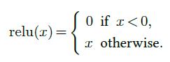
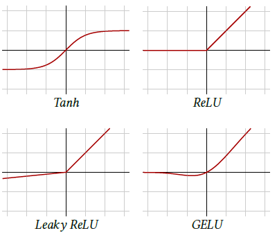
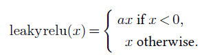
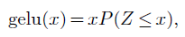

|                                                     |                    |                                          |
| --------------------------------------------------- | ------------------ | ---------------------------------------- |
| [<---   4_2_Linear_layers.md](4_2_Linear_layers.md) | [Зміст](README.md) | [4_4_Pooling.md    --->](4_4_Pooling.md) |

## 4.3    Activation functions

If a network were combining only linear components, it would itself be a linear operator, so it is essential to have **non-linear operations**. They are implemented in particular with **activation functions**, which are layers that transforms each component of the input tensor individually through a mapping, resulting in a tensor of the same shape.

There are many different activation functions, but the most used is the **Rectified Linear Unit** (**ReLU**) [Glorot et al., 2011], which sets negative values to zero and keeps positive values unchanged (see Figure 4.5, top right):

Given that the core training strategy of deep-learning relies on the gradient, it may seem problematic to have a mapping that is not differentiable at zero and constant on half the real line. However, the main property gradient descent requires is that the gradient is informative on average. Parameter initialization and data normalization make half of the activations positive when the training starts, ensuring that this is the case.

Figure 4.5: Activation functions.

Before the generalization of ReLU, the standard activation function was **Tanh** (see Figure 4.5, top left) which saturates exponentially fast on both the negative and the positive sides, aggravating the vanishing gradient.

Other popular activation functions follow the same idea of keeping positive values unchanged and squashing the negative values. **Leaky ReLU** [Maas et al., 2013] applies a small positive multiplying factor to the negative values (see Figure 4.5, bottom left):

And **GELU** [Hendrycks and Gimpel, 2016] is defined with the cumulative distribution function of the Gaussian distribution, that is:

where $Z ∼𝒩 (0,1)$. It roughly behaves like a smooth ReLU (see Figure 4.5, bottom right).

The choice of an activation function, in particular among the variants of ReLU, is generally driven by empirical performance.
