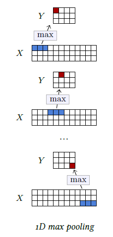

[<---   4_3_Activation_functions.md](4_3_Activation_functions.md)         [Зміст](README.md)          [4_5_Dropout.md    --->](4_5_Dropout.md) 

## 4.4    Pooling

A classical strategy to reduce the signal size is to use a **pooling** operation that combines multiple activations into one that ideally summarizes the information. The most standard operation of this class is the **max pooling** layer, which, similarly to convolution, can operate in 1D and 2D, and is defined by a **kernel size**. 

This layer computes the maximum activation per channel, over non-overlapping sub-tensors of spatial size equal to the kernel size. These values are stored in a result tensor with the same number of channels as the input, and whose spatial size is divided by the kernel size. As with the convolution, this operator has three meta-parameters: **padding**, **stride**, and **dilation**, with the stride being equal to the kernel size by default.

The max operation can be intuitively interpreted as a logical disjunction, or, when it follows a series of **convolutional layer** that compute local scores for the presence of parts, as a way of encoding that at least one instance of a part is present. It loses precise location, making it invariant to local deformations.

A standard alternative is the **average pooling** layer that computes the average instead of the maximum over the sub-tensors. This is a linear operation, whereas max pooling is not.

Figure 4.6: A 1D max pooling takes as input a $D×T$ tensor $X$, computes the max over non-overlapping $1×L$ sub-tensors and stores the values in a resulting $D×(T/L)$ tensor $Y$ .
