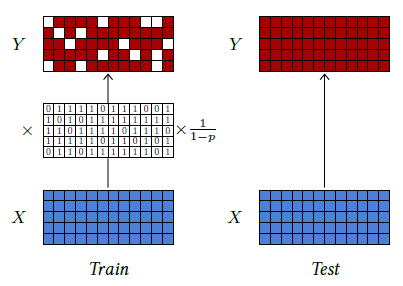

|                                         |                    |                                                              |
| --------------------------------------- | ------------------ | ------------------------------------------------------------ |
| [<---   4_4_Pooling.md](4_4_Pooling.md) | [Зміст](README.md) | [4_6_Normalizing_layers.md    --->](4_6_Normalizing_layers.md) |

## 4.5    Dropout

Some layers have been designed to explicitly facilitate training or improve the quality of the learned representations.

One of the main contributions of that sort was **dropout** [Srivastava et al., 2014]. Such a layer has no trainable parameters, but one meta-parameter, $p$, and takes as input a tensor of arbitrary shape.

It is usually switched off during testing, in which case its output is equal to its input. When it is active, it has a probability $p$ to set to zero each activation of the input tensor independently, and it re-scales all the activations by a factor of $\frac{1}{1-p}$ to maintain the expected value unchanged (see Figure 4.7).

The motivation behind dropout is to favor meaningful individual activation and discourage group representation. Since the probability that a group of $k$ activations remains intact through a dropout layer is $(1−p)^k$, joint representations become unreliable, which makes the training procedure avoid them. It can also be seen as a noise injection that makes the training more robust.

Figure 4.7: Dropout can process a tensor of arbitrary shape. During training (left), it sets activations at random to zero with probability p and applies a multiplying factor to keep the expected values unchanged. During test (right), it keeps all the activations unchanged.

When dealing with images and 2D tensors, the short-term correlation of the signals and the resulting redundancy negate the effect of dropout, since activations set to zero can be inferred from their neighbors. Hence, dropout for 2D tensors sets entire channels to zero instead of individual activations.

Although dropout is generally used to improve training and is inactive during inference, it can be used in certain setups as a randomization strategy, for instance, to estimate empirically confidence scores [Gal and Ghahramani, 2015].
