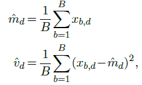
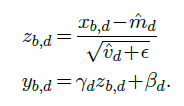
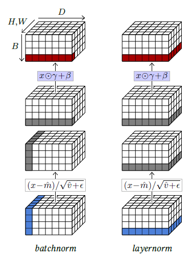

[<---   4_5_Dropout.md](4_5_Dropout.md)         [Зміст](README.md)          [4_7_Skip_connections.md    --->](4_7_Skip_connections.md) 

## 4.6    Normalizing layers

An important class of operators to facilitate the training of deep architectures are the **normalizing layers**, which force the empirical mean and variance of groups of activations.

The main layer in that family is **batch normalization** [Ioffe and Szegedy, 2015] which is the only standard layer to process batches instead of individual samples. It is parameterized by a meta-parameter $D$ and two series of trainable scalar parameters $β_1,...,β_D$ and $γ_1,...,γ_D$.

Given a batch of $B$ samples $x_1,...,x_B$ of dimension $D$, it first computes for each of the $D$ components an empirical mean $\hat{m}_d$ and variance $\hat{v}_d$ across the batch:

from which it computes for every component $x_{b,d}$ a normalized value $z_{b,d}$, with empirical mean 0 and variance 1, and from it the final result value $y_{b,d}$ with mean $β_d$ and standard deviation $γ_d$:

Figure 4.8: Batch normalization normalizes across the sample index dimension $B$ and all spatial dimensions if any, so $B,H,W$ for a $B×D×H×W$ batch tensor, and scales/shifts according to $D$, which is implemented as a component-wise product by $γ$ and a sum with $β$ of the corresponding sub-tensors (left). Layer normalization normalizes across $D$ and spatial dimensions, and scales/shifts according to the same (right).

Because this normalization is defined across a batch, it is done only during training. During testing, the layer transforms individual samples according to the $\hat{m}_d$s and $\hat{v}_d$s estimated with a moving average over the full training set, which boils down to a fix affine transformation per component.

The motivation behind batch normalization was to avoid that a change in scaling in an early layer of the network during training impacts all the layers that follow, which then have to adapt their trainable parameters accordingly. Although the actual mode of action may be more complicated than this initial motivation, this layer considerably facilitates the training of deep models.

In the case of 2D tensors, to follow the principle of convolutional layers of processing all locations similarly, the normalization is done per-channel across all 2D positions, and $β$ and $γ$ remain vectors of dimension $D$ so that the scaling/shift does not depend on the 2D position. Hence, if the tensor to process is of shape $B×D×H×W$, the layer computes ( $\hat{m}_d$,$\hat{v}_d$), for $d=1,...,D$ from the corresponding $B×H×W$ slice, normalizes it accordingly, and finally scales and shifts its components with the trainable parameters $β_d$ and $γ_d$.

So, given a $B×D$ tensor, batch normalization normalizes it across $B$ and scales/shifts it according to $D$, which can be implemented as a component-wise product by $γ$ and a sum with $β$. Given a $B×D×H×W$ it normalizes across $B,H,W$ and scales/shifts according to $D$ (see Figure 4.8, left).

This can be generalized depending on these dimensions. For instance, **layer normalization** [Ba
et al., 2016], computes moments and normalizes across all components of individual samples, and scales and shifts components individually (see Figure 4.8, right). So, given a $B×D$ tensor, it normalizes across $D$ and scales/shifts also according to $D$. Given a $B×D×H×W$ tensor, it normalizes it across $D,H,W$ and scales/shifts according to the same.

Contrary to batch normalization, since it processes samples individually, it behaves the same during training and testing.
