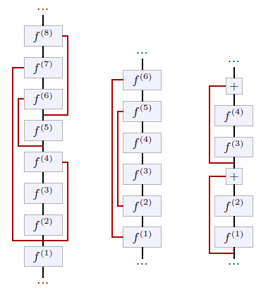

[<---   4_6_Normalizing_layers.md](4_6_Normalizing_layers.md)         [Зміст](README.md)          [4_8_Attention_layers.md    --->](4_8_Attention_layers.md) 

## 4.7    Skip connections

Another technique that mitigates the vanishing gradient and allows the training of deep architectures are **skip connections** [Long et al., 2014; Ronneberger et al., 2015]. They are not layers per se, but an architectural design in which outputs of some layers are transported as-is to other layers further in the model, bypassing processing in-between. This unmodified signal can be concatenated or added to the input to the layer the connection branches into (see Figure 4.9). A particular type of skip connections is the **residual connection** which combines the signal with a sum, and usually skips only a few layers (see Figure 4.9, right).

The most desirable property of this design is to ensure that, even in the case of gradient-killing processing at a certain stage, the gradient will still propagate through the skip connections. Residual connections, in particular, allow for the building of deep models with up to several hundred layers, and key models, such as the **residual networks** [He et al., 2015] in computer vision (see § 5.2), and the **Transformers** [Vaswani et al., 2017] in natural language processing (see § 5.3), are entirely composed of blocks of layers with residual connections. 

Figure 4.9: Skip connections, highlighted in red on this figure, transport the signal unchanged across multiple layers. Some architectures (center) that downscale and re-upscale the representation size to operate at multiple scales, have skip connections to feed outputs from the early parts of the network to later layers operating at the same scales [Long et al., 2014; Ronneberger et al., 2015]. The residual connections (right) are a special type of skip connections that sum the original signal to the transformed one, and are usually short-term, bypassing at max a handful of layers [He et al., 2015].

Their role can also be to facilitate multi-scale reasoning in models that reduce the signal size before re-expanding it, by connecting layers with compatible sizes. In the case of residual connections, they may also facilitate learning by simplifying the task to finding a differential improvement instead of a full update.
