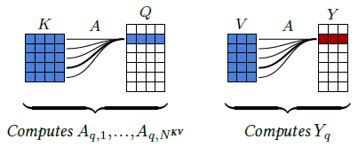
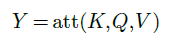
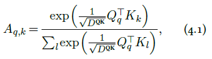
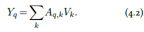
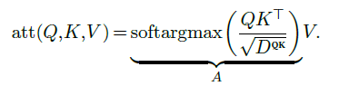
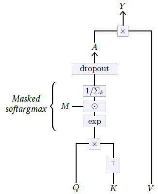
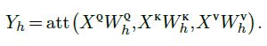
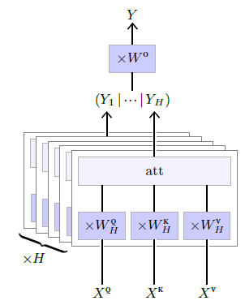

[<---   4_7_Skip_connections.md](4_7_Skip_connections.md)         [Зміст](README.md)          [ 4_9_Token_embedding.md   --->](4_9_Token_embedding.md) 

## 4.8    Attention layers

In many applications, there is a need for an operation able to combine local information at locations far apart in a tensor. For instance, this could be distant details for coherent and realistic **image synthesis**, or words at different positions in a paragraph to make a grammatical or semantic decision in **natural language processin**g.

**Fully-connected layers** cannot process largedimension signals, nor signals of variable size, and **convolutional layers** are not able to propagate information quickly. Strategies that aggregate the results of convolutions, for instance, by averaging them over large spatial areas, suffer from mixing multiple signals into a limited number of dimensions.

**Attention layers** specifically address this problem by computing an attention score for each component of the resulting tensor to each component of the input tensor, without locality constraints, and averaging features across the full tensor accordingly [Vaswani et al., 2017].

Even though they are substantially more complicated than other layers, they have become a standard element in many recent models. They are, in particular, the key building block of **Transformers**, the dominant architecture for **Large Language Models**. See § 5.3 and § 7.1.

Figure 4.10: The attention operator can be interpreted as matching every query $Q_q$ with all the keys $K_1,...,K_{N^{KV}}$ to get normalized attention scores $A_{q,1},...,A_{q,N^{KV}}$ (left, and Equation 4.1), and then averaging the values $V_1,...,V_{N^{KV}}$ with these scores to compute the resulting $Y_q$ (right, and Equation 4.2).

### Attention operator

Given

- a tensor $Q$ of **queries** of size $N^Q×D^{QK}$,
- a tensor $K$ of **keys** of size $N^{KV}×D^{QK}$, and
- a tensor $V$ of **values** of size $N^{KV}×D^V$,

the **attention operator** computes a tensor

of dimension $N^Q×D^V$. To do so, it first computes for every query index $q$ and every key index $k$ an attention score $A_{q,k}$ as the **softargmax** of the dot products between the query $Q_q$ and the keys:

where the scaling factor $\frac{1}{\sqrt{D^{QK}}}$ keeps the range of values roughly unchanged even for large $D^{QK}$.

Then a retrieved value is computed for each query by averaging the values according to the attention scores (see Figure 4.10):

So if a query $Q_n$ matches one key $K_m$ far more than all the others, the corresponding attention score $A_{n,m}$ will be close to one, and the retrieved value $Y_n$ will be the value $V_m$ associated to that key. But, if it matches several keys equally, then $Y_n$ will be the average of the associated values.

This can be implemented as

This operator is usually extended in two ways, as depicted in Figure 4.11. First, the attention matrix can be masked by multiplying it before the softargmax normalization by a Boolean matrix $M$. This allows, for instance, to make the operator **causal** by taking $M$ full of 1s below the diagonal and zero above, preventing $Yq$ from depending on keys and values of indices $k$ greater than $q$. Second, the attention matrix is processed by a **dropout layer** (see § 4.5) before being multiplied by $V$ , providing the usual benefits during training.

Figure 4.11: The attention operator $Y =att(Q,K,V )$ computes first an attention matrix $A$ as the per-query softargmax of $QK^⊤$, which may be masked by a constant matrix $M$ before the normalization. This attention matrix goes through a dropout layer before being multiplied by $V$ to get the resulting $Y$ . This operator can be made **causal** by taking $M$ full of 1s below the diagonal and zero above.

### Multi-head Attention Layer

This parameterless attention operator is the key element in the **Multi-Head Attention** layer depicted in Figure 4.12. This layer has for metaparameters a number $H$ of heads, and the shapes of three series of $H$ trainable weight matrices

- $W^Q$ of size $H×D×D^{QK}$,
- $W^K$ of size $H×D×D^{QK}$, and
- $W^V$ of size $H×D×D^V$,

to compute respectively the queries, the keys, and the values from the input, and a final weight matrix $W^O$ of size $HD^V×D$ to aggregate the per-head results.

It takes as input three sequences

- $X^Q$ of size $N^Q×D$,
- $X^K$ of size $N^{KV}×D$, and
- $X^V$ of size $N^{KV}×D$,

from which it computes, for $h=1,...,H$,

These sequences $Y_1,...,Y_H$ are concatenated along the feature dimension and each individual element of the resulting sequence is multiplied by $W^O$ to get the final result:

As we will see in [§ 5.3](5_3_Attention_models.md) and in Figure 5.6, this layer is used to build two model sub-structures: **self-attention blocks**, in which the three input sequences $X^Q$, $X^K$, and $X^V$ are the same, and **cross-attention blocks**, where $X^K$ and $X^V$ are the same.

It is noteworthy that the attention operator, and consequently the multi-head attention layer when there is no masking, is invariant to a permutation of the keys and values, and equivariant to a permutation of the queries, as it would permute the resulting tensor similarly.

Figure 4.12: The Multi-head Attention layer applies for each of its $h=1,...,H$ heads a parametrized linear transformation to individual elements of the input sequences $X^Q,X^K,X^V$ to get sequences $Q,K,V$ that are processed by the attention operator to compute $Y_h$. These $H$ sequences are concatenated along features, and individual elements are passed through one last linear operator to get the final result sequence $Y$.

