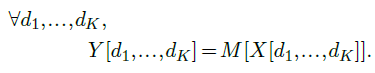

|                                                           |                    |                                                              |
| --------------------------------------------------------- | ------------------ | ------------------------------------------------------------ |
| [<---   4_8_Attention_layers.md](4_8_Attention_layers.md) | [Зміст](README.md) | [4_10_Positional_encoding.md    --->](4_10_Positional_encoding.md) |

## 4.9    Token embedding

In many situations, we need to convert discrete tokens into vectors. This can be donewith an **embedding layer**, which consists of a lookup table that directly maps integers to vectors.

Such a layer is defined by two meta-parameters: the number $N$ of possible token values, and the dimension $D$ of the output vectors, and one trainable $N×D$ weight matrix $M$.

Given as input an integer tensor $X$ of dimension $D_1×···×D_K$ and values in $\{0,...,N−1\}$  such a layer returns a real-valued tensor $Y$ of dimension $D_1×···×D_K×D$ with

