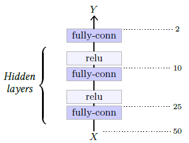

## 5.1    Multi-Layer Perceptrons

The simplest deep architecture is the **Multi-Layer Perceptron** (**MLP**), which takes the form of a succession of **fully-connected layers** separated by **activation functions**. See an example in Figure 5.1. For historical reasons, in such a model, the number of **hidden layers** refers to the number of linear layers, excluding the last one.

A key theoretical result is the **universal approximation theorem** [Cybenko, 1989] which states that, if the activation function $\rho$ is not polynomial, any continuous function $f$ can be approximated arbitrarily well uniformly on a compact domain, that is bounded and containing its boundary, by a model of the form $l_2◦σ◦l_1$ where $l_1$ and $l_2$ are affine. Such a model is a MLP with a single hidden layer, and this result implies that it can approximate anything of practical value. However, this approximation holds if the dimension of the first linear layer’s output can be arbitrarily large.

In spite of their simplicity, MLPs remain an important tool when the dimension of the signal to be processed is not too large.

Figure 5.1: This multi-layer perceptron takes as input a one dimension tensor of size 50, is composed of three fully-connected layers with outputs of dimensions respectively 25, 10, and 2, the two first followed by ReLU layers.

