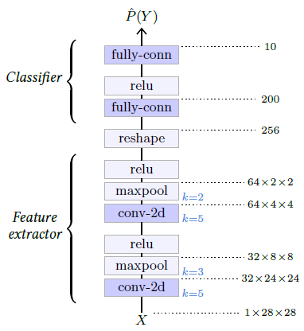
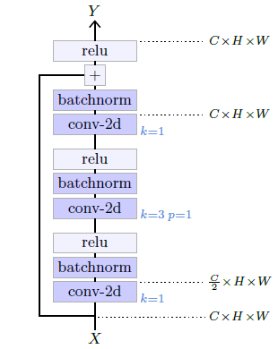
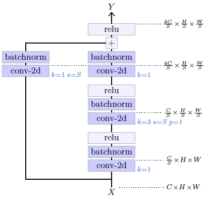
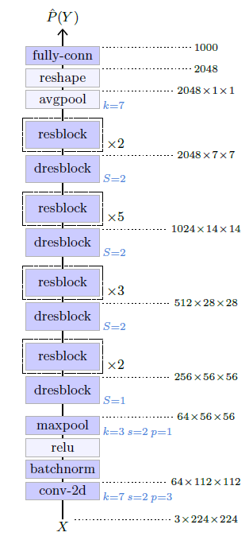

## 5.2    Convolutional networks

 The standard architecture for **processing images** is a **convolutional network**, or **convnet**, that combines multiple **convolutional layers**, either to reduce the signal size before it can be processed by **fully-connected layers**, or to output a 2D signal also of large size.

### LeNet-like

 The original **LeNet** model for image classification [LeCun et al., 1998] combines a series of 2D **convolutional layers** and max pooling layers that play the role of feature extractor, with a series of **fully-connected layers** which act like a MLP and perform the classification per se (see Figure 5.2).

This architecture was the blueprint for many models that share its structure and are simply larger, such as AlexNet [Krizhevsky et al., 2012] or the VGG family [Simonyan and Zisserman, 2014].

### Residual networks

Standard convolutional neural networks that follow the architecture of the LeNet family are not easily extended to deep architectures and suffer from the vanishing gradient problem. The **residual networks**, or **ResNets**, proposed by He et al. [2015] explicitly address the issue of the vanishing gradient with **residual connections** (see § 4.7), that allow hundreds of layers. They have become standard architectures for computer vision applications, and exist in multiple versions depending on the number of layers. We are going to look in detail at the architecture of the **ResNet-50** for classification.

Figure 5.2: Example of a small **LeNet-like** network for classifying 28×28 grayscale images of handwritten digits [LeCun et al., 1998]. Its first half is convolutional, and alternates convolutional layers per se and max pooling layers, reducing the signal dimension for 28×28 scalars to 256. Its second half processes this 256 dimension feature vector through a one hidden layer perceptron to compute 10 logit scores corresponding to the ten possible digits.

Figure 5.3: A residual block.

Figure 5.4: A downscaling residual block. It admits a meta-parameter $S$, the stride of the first convolution layer, which modulates the reduction of the tensor size.

As other ResNets, it is composed of a series of **residual blocks**, each combining several **convolutional layers**, **batch norm** layers, and ReLU layers, wrapped in a residual connection. Such a block is pictured in Figure 5.3.

A key requirement for high performance with real images is to propagate a signal with a large number of channels, to allow for a rich representation. However, the parameter count of a convolutional layer, and its computational cost, are quadratic with the number of channels. This residual block mitigates this problem by first reducing the number of channels with a 1×1 convolution, then operating spatially with a 3×3 convolution on this reduced number of channels, and then upscaling the number of channels, again with a 1×1 convolution.

Figure 5.5: Structure of the ResNet-50 [He et al., 2015].

The network reduces the dimensionality of the signal to finally compute the logits for the classification. This is done thanks to an architecture composed of several sections, each starting with a **downscaling residual block** that halves the height and width of the signal, and doubles the number of channels, followed by a series of residual blocks. Such a downscaling residual block has a structure similar to a standard residual block, except that it requires a residual connection that changes the tensor shape. This is achieved with a 1×1 convolution with a stride of two (see Figure 5.4).

The overall structure of the ResNet-50 is presented in Figure 5.5. It starts with a 7×7 convolutional layer that converts the three-channel input image to a 64-channel image of half the size, followed by four sections of residual blocks. Surprisingly, in the first section, there is no downscaling, only an increase of the number of channels by a factor of 4. The output of the last residual block is 2048×7×7, which is converted to a vector of dimension 2048 by an average pooling of kernel size 7×7, and then processed through a fully-connected layer to get the final logits, here for 1000 classes.
