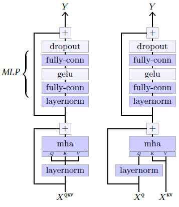
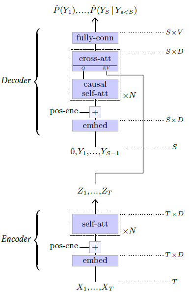
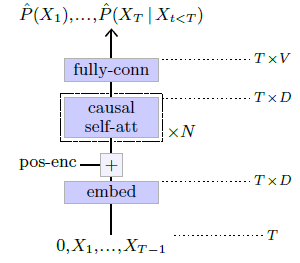
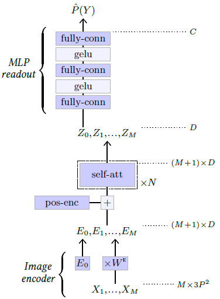

|                                                              |                    |                                              |
| ------------------------------------------------------------ | ------------------ | -------------------------------------------- |
| [<---   5_2_Convolutional_networks.md](5_2_Convolutional_networks.md) | [Зміст](README.md) | [6__Prediction.md    --->](6__Prediction.md) |

## 5.3    Attention models

As stated in § 4.8, many applications, in particular from natural language processing, greatly benefit from models that include attention mechanisms. The architecture of choice for such tasks, which has been instrumental in recent advances in deep learning, is the **Transformer** proposed by Vaswani et al. [2017].

#### Transformer

 The original Transformer, pictured in Figure 5.7, was designed for sequence-to-sequence translation. It combines an encoder that processes the input sequence to get a refined representation, and an autoregressive decoder that generates each token of the result sequence, given the encoder’s representation of the input sequence and the output tokens generated so far. As the residual convolutional networks of [§ 5.2](5_2_Convolutional_networks.md), both the encoder and the decoder of the Transformer are sequences of compounded blocks built with residual connections.

The **self-attention block**, pictured on the left of Figure 5.6, combines a **Multi-Head Attention** layer (see § 4.8), that recombines information globally, allowing any position to collect information from any other positions, with a one-hidden-layer **MLP** that updates representations at every position separately. This block can be made **causal** by using an adequate attention mask, as described in [§ 4.8](4_8_Attention_layers.md)

Figure 5.6: **Self-attention block** (left) and **cross-attention block** (right). These specific structures proposed by Radford et al. [2018] differ slightly from the original architecture of Vaswani et al. [2017], in particular by having the layer normalization first in the residual blocks.

Figure 5.7: Original encoder-decoder **Transformer model** for sequence-to-sequence translation [Vaswani et al., 2017].

The **cross-attention block**, pictured on the right of Figure 5.6, is similar except that it takes as input two sequences, one to compute the queries and one to compute the keys and values.

The encoder of the Transformer (see Figure 5.7, bottom), recodes the input sequence of discrete tokens $X_1,...X_T$ with an **embedding layer** (see [§ 4.9](4_9_Token_embedding.md)), and adds a **positional encoding** (see [§ 4.10](4_10_Positional_encoding.md)), before processing it with several self-attention blocks to generate a refined representation $Z_1,...,Z_T$

The decoder (see Figure 5.7, top), takes as input the sequence $Y_1,...,Y_{S−1}$ of result tokens produced so far, similarly recodes them through an embedding layer, adds a positional encoding, and processes it through alternating causal selfattention blocks and cross-attention blocks to produce the logits predicting the next tokens. These cross-attention blocks compute their keys and values from the encoder’s result representation $Z_1,...,Z_T$ , which allows the resulting sequence to be a function of the original sequence
$X_1,...,X_T$ .

Figure 5.8: GPT model [Radford et al., 2018].

As we saw in [§ 3.2](3_2_Autoregressive_models.md), being **causal** ensures that, such a model can be trained by minimizing the cross-entropy summed across the full sequence.

#### Generative Pre-trained Transformer

The Generative Pre-trained Transformer (**GPT**) [Radford et al., 2018, 2019], pictured in Figure 5.8 is a pure autoregressive model that consists of a succession of causal self-attention blocks, hence a causal version of the original Transformer encoder. We come back to how they are used for text generation in [§ 7.1](7_1_Text_generation.md).

Figure 5.9: Vision Transformer model [Dosovitskiy et al., 2020].

This class of models scales extremely well, up to hundreds of billions of trainable parameters [Brown et al., 2020].

#### Vision Transformer

Transformers have been put to use for image classification with the **Vision Transformer** (ViT) model [Dosovitskiy et al., 2020] (see Figure 5.9).

It splits the three-channel input image into $M$ patches of resolution $P×P$, which are then flattened to create a sequence of vectors $X_1,...,X_M$ of shape $M×3P^2$. This sequence is multiplied by a trainable matrix $W^E$ of shape $3P^2×D$ to map it to a $M×D$ sequence, to which is concatenated one trainable vector $E_0$. The resulting $(M+1)×D$ sequence $E_0,...,E_M$ is then processed through multiple self-attention blocks. See [§ 5.3](5_3_Attention_models.md) and Figure 5.6. 

The first element $Z_0$ in the resultant sequence, which corresponds to $E_0$ and is not associated which any part of the image, is finally processed by a two-hidden-layer MLP to get the final $C$ logits. Such a token, added for a readout of a class prediction, was introduced by Devlin et al. [2018] in the BERT model and is referred to as a **CLS token**.

