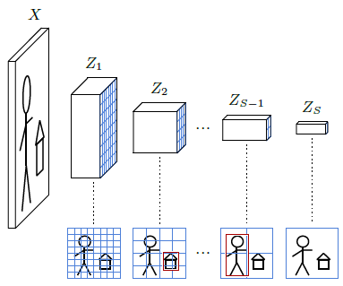
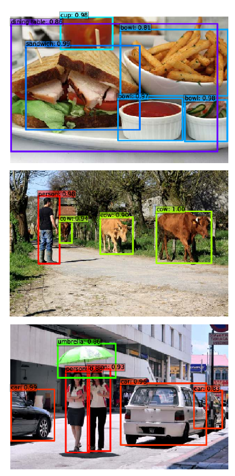

|                                                              |                    |                                                              |
| ------------------------------------------------------------ | ------------------ | ------------------------------------------------------------ |
| [<---   6_2_Image_classification.md](6_2_Image_classification.md) | [Зміст](README.md) | [6_4_Semantic_segmentation.md    --->](6_4_Semantic_segmentation.md) |

## 6.3    Object detection

A more complex task for image understanding is **object detection**, in which the objective is, given an input image, to predict the classes and positions of objects of interest.

An object position is formalized as the four coordinates ($x_1,y_1,x_2,y_2$) of a rectangular bounding box, and the ground truth associated with each training image is a list of such bounding boxes, each labeled with the class of the object in it.

The standard approach to solve this task, for instance, by the **Single Shot Detector** (SSD) [Liu et al., 2015]), is to use a convolutional neural network that produces a sequence of image representations $Z_s$ of size $D_s×H_s×W_s$, $s=1,...,S$, with decreasing spatial resolution $H_s×W_s$ down to 1×1 for $s=S$ (see Figure 6.1). Each of those tensors covers the input image in full, so the $h,w$ indices correspond to a partitioning of the image lattice into regular squares that gets coarser when $s$ increases. As seen in [§ 4.2](4_2_Linear_layers.md), and illustrated in Figure 4.4, due to the succession of **convolutional layers**, a feature vector ($Z_s[0,h,w],...,Z_s[D_s−1,h,w]$) is a descriptor of an area of the image, called its **receptive field**, that is larger than this square but centered on it. This results in a non-ambiguous matching of any bounding box ($x_1,x_2,y_1,y_2$) to a $s,h,w$, determined respectively by $max(x_2−x_1,y_2−y_1)$, $\frac{y_1+y_2}{2}$ , and $\frac{x_1+x_2}{2}$ .

Figure 6.1: A convolutional object detector processes the input image to generate a sequence of representations of decreasing resolutions. It computes for every h,w, at every scale s, a pre-defined number of bounding boxes whose centers are in the image area corresponding to that cell, and whose size are such that they fit in its receptive field. Each prediction takes the form of the estimates ($\hat{x}_1,\hat{x}_2,\hat{y}_1,\hat{y}_2$), represented by the red boxes above, and a vector of $C+1$ logits for the $C$ classes of interest, and an additional “no object” class.

Figure 6.2: Examples of object detection with the Single-Shot Detector [Liu et al., 2015].

Detection is achieved by adding $S$ convolutional layers, each processing a $Z_s$ and computing for every tensor indices $h,w$ the coordinates of a bounding box, and the associated logits. If there are $C$ object classes, there are $C+1$ logits, the additional one standing for “no object.” Hence, each additional convolution layer has $4+C+1$ output channels. The SSD algorithm in particular generates several bounding boxes per $s,h,w$, each dedicated to a hard-coded range of aspect ratios.

Training sets for object detection are costly to create, since the labeling with bounding boxes requires a slow human intervention. To mitigate this issue, the standard approach is to start with a convolutional model that has been **pre-trained** on a large classification data set such as VGG-16 for the original SSD, and to replace its final fully-connected layers with additional convolutional ones. Surprisingly, models trained for classification only have learned feature representations that can be repurposed for object detection, even though that task involves the regression of geometric quantities.

During training, every ground-truth bounding box is associated with its $s,h,w$, and induces a loss term composed of a cross-entropy loss for the logits, and a regression loss such as MSE for the bounding box coordinates. Every other $s,h,w$ free of bounding-box match induces a cross-entropy only penalty to predict the class “no object”.
