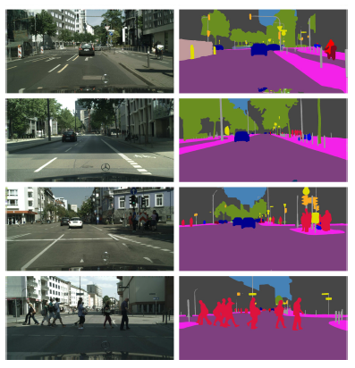

[<---   6_3_Object_detection.md](6_3_Object_detection.md)         [Зміст](README.md)          [6_5_Speech_recognition.md    --->](6_5_Speech_recognition.md) 

## 6.4    Semantic segmentation

The finest-grain prediction task for image understanding is **semantic segmentation**, which consists of predicting, for every pixel, the class of the object to which it belongs. This can be achieved with a standard convolutional neural network that outputs a convolutional map with as many channels as classes, carrying the estimated logits for every pixel.

While a standard residual network, for instance, can generate a dense output of the same resolution as its input, as for object detection, this task requires operating at multiple scales. This is necessary so that any object, or sufficiently informative sub-part, regardless of its size, is captured somewhere in the model by the feature representation at a single tensor position. Hence, standard architectures for that task downscale the image with a series of **convolutional layers** to increase the receptive field of the activations, and re-upscale it with a series of **transposed convolutional layers**, or other upscaling methods such as bilinear interpolation, to make the prediction at high resolution.

However, a strict downscaling-upscaling architecture does not allow for operating at a fine grain when making the final prediction, since all the signal has been transmitted through a lowresolution representation at some point. Models that apply such downscaling-upscaling serially mitigate these issues with **skip connections** from layers at a certain resolution, before downscaling, to layers at the same resolution, after upscaling [Long et al., 2014; Ronneberger et al., 2015]. Models that do it in parallel, after a convolutional backbone, concatenate the resulting multi-scale representation after upscaling, before making the final per-pixel prediction [Zhao et al., 2016].

Training is achieved with a standard crossentropy summed over all the pixels. As for object detection, training can start from a **network pretrained** on a large-scale image classification data set to compensate for the limited availability of segmentation ground truth.

Figure 6.3: Semantic segmentation results with the Pyramid Scene Parsing Network [Zhao et al., 2016].
