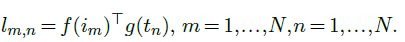
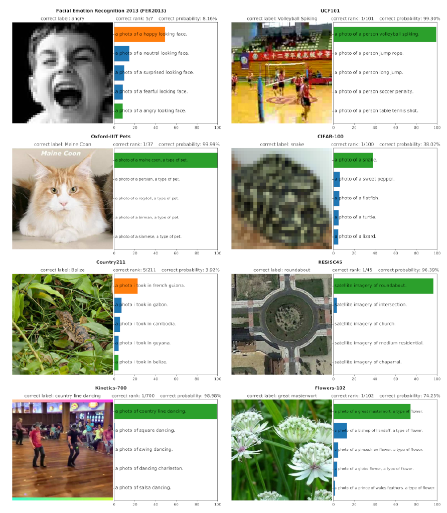

## 6.6    Text-image representations

A powerful approach to image understanding consists of learning consistent image and text representations, such that an image, or a textual description of it, would be mapped to the same feature vector.

The Contrastive Language-Image Pre-training (**CLIP**) proposed by Radford et al. [2021] combines an image encoder $f$, which is a **ViT**, and a text encoder $g$, which is a **GPT**. See [§ 5.3](5_3_Attention_models.md) for both.

To repurpose a GPT as a text encoder, instead of a standard autoregressive model, they add to the input sequence an “end of sentence” token, and use the representation of this token in the last layer as the embedding. Both embeddings have the same dimension, which, depending on the configuration, is between 512 and 1024.

Those two models are trained from scratch using a data set of 400 million image-text pairs ($i_k,t_k$) collected from the internet. The training procedure follows the standard mini-batch stochastic gradient descent approach but relies on a **contrastive loss**. The embeddings are computed for every image and every text of the $N$ pairs in the mini-batch, and a cosine similarity measure is computed not only between text and image embeddings from each pair, but also across pairs, resulting in an $N×N$ matrix of similarity scores:

The model is trained with cross-entropy so that, $∀n$ the values $l_{1,n},...,l_{N,n}$ interpreted as logit scores predict $n$, and similarly for $l_{n,1},...,l_{n,N}$ . This means that $∀n,m$, s.t. $n\ne{m}$ the similarity $l_{n,n}$ is unambiguously greater than both $l_{n,m}$ and $l_{m,n}$.

When it has been trained, this model can be used to do **zero-shot prediction**, that is, classifying a signal in the absence of training examples by defining a series of candidate classes with text descriptions, and computing the similarity of the embedding of an image with the embedding of each of those descriptions (see Figure 6.4).

Additionally, since the textual descriptions are often detailed, such a model has to capture a richer representation of images and pick up cues overlooked by classifier networks. This translates to excellent performance on challenging datasets such as ImageNet Adversarial [Hendrycks et al., 2019] which was specifically designed to degrade or erase cues on which standard predictors rely.

Figure 6.4: The CLIP text-image embedding [Radford et al., 2021] allows to do zero-shot prediction by predicting what class description embedding is the most consistent with the image embedding.
