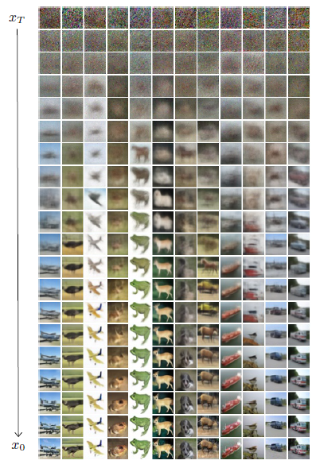
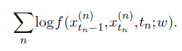
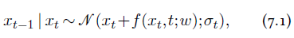

[<---   7_1_Text_generation.md](7_1_Text_generation.md)         [Зміст](README.md)          [The_missing_bits.md   --->](The_missing_bits.md) 

## 7.2    Image generation

Multiple deep methods have been developed to model and sample from a high-dimensional density. A powerful approach for **image synthesis** relies on inverting a **diffusion process**. 

The principle consists of defining analytically a process that gradually degrades any sample, and consequently transforms the complex and unknown density of the data into a simple and well-known density such as a normal, and training a deep architecture to invert this degradation process [Ho et al., 2020].

Given a fixed $T$, the diffusion process defines a probabilities over series of $T+1$ images as follows: samples $x_0$ uniformly in the data set, and then go on sampling $x_{t+1} ∼p(x_{t+1} | x_t)$ where the conditional distribution $p$ is defined analytically, and such that it gradually erases the structure that was in $x_0$. The setup should be such that the distribution $p(x_T)$ of $x_T$ has a simple, known form, so in particular does not depend on the complicated data distribution $p(x_0)$, and can be sampled.

For instance, Ho et al. [2020] normalize the data to have a mean of 0 and a variance of 1, and their diffusion process consists of adding a bit of white noise and re-normalizing the variance to 1. This process exponentially reduces the importance of $x_0$, and $x_t$’s density can rapidly be approximated with a normal.

Figure 7.1: Image synthesis with denoising diffusion [Ho et al., 2020]. Each sample starts as a white noise
$x_T$ (top), and is gradually de-noised by sampling iteratively $x_{t−1} | x_t ∼𝒩 (x_t+f(x_t,t;w),σ_t)$.

The denoiser f is a deep architecture that should model and allow sampling from, $f(x_{t−1},x_t,t;w)≃p(x_{t−1} | x_t)$. It can be shown, thanks to a **variational bound**, that if this one-step reverse process is accurate enough, sampling $x_T ∼p(x_T)$ and denoising $T$ steps with $f$ results in a $x_0$ that follows $p(x_0)$.

Training $f$ can be achieved by generating a large number of sequences $x^{(n)}_0 ,...,x^{(n)}_T$ , picking a $t_n$ in each, and maximizing

Given their diffusion process, Ho et al. [2020] have a denoising of the form:

where $σ_t$ is defined analytically 

In practice, such a model initially hallucinates structures by pure luck in the random noise, and then gradually build more elements that emerge from the noise by reinforcing the most likely continuation of the image obtained thus far.

This approach can be extended to text conditioned synthesis, to generate images that match a description. For instance, Nichol et al. [2021] add to the mean of the denoising distribution of Equation 7.1 a bias that goes in the direction of increasing the CLIP matching score (see [§ 6.6](6_6_Text_image_representations.md)) between the produced image and the conditioning text description.

