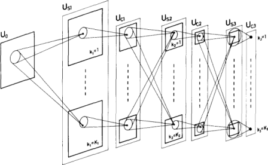

|                                                |      |                                                   |
| ---------------------------------------------- | ---- | ------------------------------------------------- |
| [<<---- До головної сторінки](../../README.md) |      | [Машинне навчання   --->](1__Machine_Learning.md) |

# Маленька книга про глибоке навчання

François Fleuret

У даному розділі міститься конспект, який створений на базі вільного перекладу книги The Little Book of Deep Learning, яку можна завантажити за [цим посиланням](https://fleuret.org/public/lbdl.pdf). Конспект містить усі перекладені розділи з моїми доповненнями. Обговорення даної версії конспекту та [посиланням](https://github.com/pupenasan/ml/issues/3). Ліцензія дозволяє змінювати, перекладати та поширювати книгу. 

Словник термінів [за цим посиланням](../../dictionary.md)

> This book is licensed under the [Creative Commons BY-NC-SA 4.0 International License.](https://creativecommons.org/licenses/by-nc-sa/4.0/)
> Preprint–June 11, 2023

[François Fleuret](https://fleuret.org/francois/) is a professor of computer sci- ence at the University of Geneva, Switzerland. The cover illustration is a schematic of the Neocognitron by  Fukushima [1980], a key ancestor of deep neural networks.

[Франсуа Флере](https://fleuret.org/francois/) — професор комп’ютерних наук Женевського університету, Швейцарія. Ілюстрація обкладинки — це схема Неокогнітрона Фукусіми [1980], основного прабатька глибоких нейронних мереж.

## Зміст

[Передмова](foreword.md)

### I Foundations

- 1 [Машинне навчання](1__Machine_Learning.md)
  - 1.1 [Learning from data](1_1_Learning_from_data.md)
  - 1.2 [Basis function regression](1_2_Basis_function_regression.md)
  - 1.3 [Under and overfitting](1_3_Under_and_overfitting.md)
  - 1.4 [Categories of models](1_4_Categories_of_models.md)
- 2 [Efficient computation](2__Efficient_computation.md)
  - 2.1 [GPUs, TPUs, and batches](2_1_GPUs_TPUs_and_batches.md)
  - 2.2 [Tensors](2_2_Tensors.md)
- 3 [Training](3__Training.md)
  - 3.1 [Losses](3_1_Losses.md)
  - 3.2 [Autoregressive models](3_2_Autoregressive_models.md)
  - 3.3 [Gradient descent](3_3_Gradient_descent.md)
  - 3.4 [Backpropagation](3_4_Backpropagation.md)
  - 3.5 [Training protocols](3_5_Training_protocols.md)
  - 3.6 [The benefits of scale](3_6_The_benefits_of_scale.md)

### II   Deep models

- 4 [Model components](4__Model_components.md)
  - 4.1 [The notion of layer](4_1_The_notion_of_layer.md)
  - 4.2 [Linear layers](4_2_Linear_layers.md)
  - 4.3 [Activation functions](4_3_Activation_functions.md)
  - 4.4 [Pooling](4_4_Pooling.md)
  - 4.5 [Dropout](4_5_Dropout.md)
  - 4.6 [Normalizing layers](4_6_Normalizing_layers.md)
  - 4.7 [Skip connections](4_7_Skip_connections.md)
  - 4.8 [Attention layers](4_8_Attention_layers.md)
  - 4.9 [Token embedding](4_9_Token_embedding.md)
  - 4.10 [Positional encoding](4_10_Positional_encoding.md)
- 5 [Architectures](5__Architectures.md)
  - 5.1 [Multi-Layer Perceptrons](5_1_Multi_Layer_Perceptrons.md)
  - 5.2 [Convolutional networks](5_2_Convolutional_networks.md)
  - 5.3 [Attention models](5_3_Attention_models.md)

### III Applications

- 6 [Prediction](6__Prediction.md)
  - 6.1 [Image denoising](6_1_Image_denoising.md)
  - 6.2 [Image classification](6_2_Image_classification.md)
  - 6.3 [Object detection](6_3_Object_detection.md)
  - 6.4 [Semantic segmentation](6_4_Semantic_segmentation.md)
  - 6.5 [Speech recognition](6_5_Speech_recognition.md)
  - 6.6 [Text-image representations](6_6_Text_image_representations.md)
- 7 [Synthesis](7__Synthesis.md)
  - 7.1 [Text generation](7_1_Text_generation.md)
  - 7.2 [Image generation](7_2_Image_generation.md)

[The missing bits](The_missing_bits.md)

[Afterword](Afterword.md)

[Bibliography](Bibliography.md)

